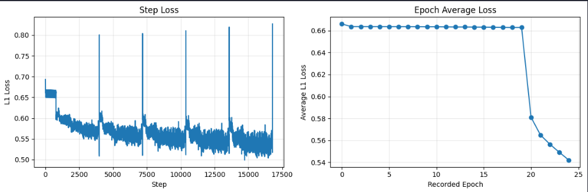

---

# Super-Resolution with JEPA 🔍

A self-supervised image-restoration / super-resolution project built around the
**Joint-Embedding Predictive Architecture (JEPA)** and a lightweight MobileNetV3
backbone. The repository now contains **two independent pipelines**:

| Pipeline | File(s) | What it does | Resolution change? |
|---|---|---|---|
| **A — Frequency JEPA** | `JEPA.ipynb`, `src/` | Predicts missing **high-frequency detail** from low-frequency content in the FFT domain | ❌ No (256→256, deblur/restore) |
| **B — Spatial Super-Resolution** | `sr.py`, `JEPA_SR.ipynb` | Predicts a **high-resolution image from a low-resolution one** (genuine upscaling) | ✅ Yes (e.g. 64→256) |

> ⚠️ **Honesty note:** Pipeline A is *not* classic super-resolution — input and
> output are the same size; it restores detail that a low-pass filter removed.
> Pipeline B is the genuine "low-res image → high-res image" model. If you came
> here for upscaling, use **Pipeline B**.

---

## 🧠 Architecture Overview

### Shared building blocks (`src/Models.py`)

* **`JEPAEncoder`** — MobileNetV3-Small features + a 1×1 projection head
  (`Conv → BatchNorm → GELU`). The input-channel count is configurable
  (`in_channels`): `2` for FFT real+imag, `1`/`3` for grayscale/RGB images.
  256×256 input → an **8×8×latent** feature map.
* **`JEPAPredictor`** — a small conv network mapping context latents to
  predicted target latents.
* **`JEPADecoder`** — five bilinear-upsampling blocks (8→256) with a configurable
  `out_channels` (`2` = FFT spectrum, `1`/`3` = image).

### Pipeline A — Frequency JEPA (two-phase, in `JEPA.ipynb`)

1. **Phase 1 — Representation learning.** FFT splits each frame into a low-pass
   and high-pass band. The context encoder embeds the **low** band, the predictor
   predicts the **high**-band latent, and an **EMA target encoder** embeds the
   real high band. Loss = **MSE** between predicted and target latents.
2. **Phase 2 — Decoding.** The (frozen) encoder/predictor feed the decoder, which
   reconstructs the high-frequency **spectrum**. Inference recombines
   `low + predicted_high` and inverse-FFTs back to an image.

### Pipeline B — Spatial Super-Resolution (single-phase, in `sr.py`)

Standard **residual** super-resolution — simple and well-behaved:

```
LR ──bicubic──► LR_up (256×256) ──encoder→predictor→decoder──► residual
HR_pred = LR_up + residual
loss   = L1(HR_pred, HR)          (image space)
metric = PSNR vs. the bicubic baseline
```

The two-phase / EMA machinery is dropped here: with full HR supervision,
end-to-end training is simpler and stronger.


---

## 📈 Loss Functions & Metrics

| Stage | Loss | Notes |
|---|---|---|
| Pipeline A · Phase 1 | **MSE** on latents | Predicted high-band latent vs. EMA target latent |
| Pipeline A · Phase 2 | **image-space L1 + 0.1 × frequency-domain L1** | Inverse-FFT is differentiable, so the decoder is optimized on how the *picture* looks, not raw spectrum magnitudes |
| Pipeline B (SR) | **image-space L1** | On the reconstructed RGB image; residual learning |
| Metric (SR) | **PSNR** (dB) | Reported every step against the bicubic-upsample baseline |

> A previous version of Phase 2 standardized both the prediction and the target
> by the *same* scalar mean/std. That cancels algebraically to a plain (rescaled)
> L1 — a no-op — and has been removed. See the changelog below.

### Training loss curves (Pipeline A)

Recorded from the actual training checkpoints (`phase1_jepa.pth`,
`frequency_jepa_sr.pth`):



* **Phase 1 — Representation learning (left, log scale).** The latent **MSE**
  against the EMA target drops ~2.9×10⁻² → 6×10⁻⁵ over 7 epochs (634 steps),
  confirming the predictor learns to match the target latents without collapse.
* **Phase 2 — Decoder reconstruction (right).** The **image-space L1 + 0.1×
  frequency L1** falls ~0.666 → 0.542 over 25 epochs (16,785 steps); the few
  transient spikes coincide with training-resume boundaries.

> Regenerate any time from the checkpoint with `sr.plot_history()` (Pipeline B)
> or from the figure script used above (Pipeline A).

---

## 🛠️ Changelog (what was fixed & added)

**Correctness fixes (Pipeline A)**

* **Phase-2 loss bug fixed.** Replaced the no-op mean/std standardization with a
  real **image-space L1 + small frequency L1**.
* **Train/inference mismatch fixed.** The single-image inference path now applies
  the same per-band FFT normalization used during training.
* Fixed the kernel-staleness guard cell to match the new code.

**Training quality (both pipelines)**

* **Gradient clipping** (`GRAD_CLIP_NORM`) for stability.
* **Cosine LR schedule** for the decoder / SR network.
* **Embedding-std diagnostic** in Phase 1 to confirm there is no representation
  collapse (BatchNorm already makes hard collapse unlikely).

**New: Pipeline B — genuine super-resolution**

* `sr.py` — self-contained model (`JEPASuperResolver`), data streamer,
  training loop, inference, **PSNR**, and plotting helpers
  (`plot_history`, `plot_result`, `plot_crops`).
* `JEPA_SR.ipynb` — a Run-All driver.
* `src/Models.py` made **channel-flexible** (backward compatible).
* `SR_*` configuration knobs in `config.py`.

---

## 📊 Evaluation & Current Results

**Inference speed (RTX 3050, Pipeline A):**

* Model load: ~0.7 s · Inference: ~16 ms/image · ~63 FPS

**Pipeline B (super-resolution) — current status: needs work.**

On an **out-of-distribution** test image (a "dog" meme), the model trained on
traffic footage currently scores:

```
Super-res PSNR: 24.32 dB   vs   bicubic baseline: 29.35 dB
```

➡️ The SR model is presently **below the bicubic baseline** and introduces
**color (chroma) artifacts**. This is expected given the open weaknesses below
(domain mismatch + 8×8 bottleneck + no identity init) and is the main thing to
improve next. The structure/edges are recovered well; the color residual is the
problem.

---

## ⚖️ Strengths & Weaknesses

### Strengths

* **Real-time inference** (~63 FPS for Pipeline A) — suitable for edge deployment.
* **Lightweight** MobileNetV3-Small backbone, trainable on mid-range GPUs.
* **Two clean, documented pipelines** with checkpointing, resumable training, and
  a proper PSNR baseline comparison for SR.

### Weaknesses & Areas for Improvement

1. **Pipeline B currently loses to bicubic.** Top priorities to fix:
   * **Domain mismatch** — trained on traffic video, evaluated on arbitrary
     images. Evaluate on a **held-out video frame**, and/or train on data that
     matches the target domain.
   * **No identity initialization** — the decoder's last conv should be
     **zero-initialized** so training *starts* at the bicubic output (can only
     improve), instead of a random residual that damages the image.
   * **Color artifacts** — super-resolve **luma (Y) only** and keep chroma from
     bicubic (classic SR practice) to eliminate the green/magenta blotches.
2. **8×8 bottleneck** — squeezing 256×256 to 8×8 before upsampling 32× discards
   the fine spatial detail SR needs. A **skip/U-Net connection** or a shallower,
   higher-resolution backbone would help a lot.
3. **Pipeline A is not true super-resolution** — it restores detail at a fixed
   resolution. Its inference reconstruction is also **scale-distorted**, because
   `src/Extraction.py` normalizes the low and high FFT bands by *different*
   per-sample factors, so `low + high` no longer reproduces the original
   brightness/contrast faithfully.
4. **No perceptual / adversarial loss** — pure L1/MSE yields smooth textures.
   A VGG perceptual loss or a GAN discriminator would improve perceived sharpness.
5. **Limited & narrow training data** — essentially one video; add diversity.
6. **Metrics** — PSNR is implemented for SR; **SSIM** is still missing for both
   pipelines.

---

## 📁 Repository Structure

```
SuperResolution/
├── config.py            # All hyperparameters & paths (frequency + SR knobs)
├── JEPA.ipynb           # Pipeline A: two-phase frequency JEPA training/inference
├── sr.py                # Pipeline B: spatial super-resolution (model+train+infer+plots)
├── JEPA_SR.ipynb        # Pipeline B: Run-All driver
├── src/
│   ├── __init__.py
│   ├── Models.py        # JEPAEncoder / JEPAPredictor / JEPADecoder (channel-flexible)
│   └── Extraction.py    # FFT low/high-band frame streamer (Pipeline A)
└── data/
    ├── QAvideo1.mp4     # Training video (frames)
    └── dog.png          # Demo test image
```

---

## 🚀 Getting Started

### Prerequisites

```bash
pip install torch torchvision opencv-python numpy matplotlib
```

### Pipeline B — Super-Resolution (recommended)

Local:

```bash
python sr.py            # trains using config.SR_*, then runs a demo inference
```

In a notebook / Colab:

```python
import sr
model  = sr.train()                 # uses SR_EPOCHS from config.py
result = sr.run_inference(model)     # degrade → super-resolve → PSNR
sr.plot_history()                    # loss + PSNR curves
sr.plot_result(result)               # low-res | super-res | high-res | error
sr.plot_crops(result)                # zoomed pixel-level comparison

# Super-resolve a real low-res photo (no HR reference needed):
sr.super_resolve("data/dog.png", model=model, save_path="sr_real.png")
```

**Colab quickstart**

```python
import torch; print("CUDA:", torch.cuda.is_available())   # need a GPU runtime
# upload/clone the repo, then:
%cd SuperResolution
import sr
model  = sr.train()
result = sr.run_inference(model)
sr.plot_result(result); sr.plot_crops(result)
```

### Pipeline A — Frequency JEPA

Open `JEPA.ipynb` in Jupyter/VS Code and **Run All** (it is notebook JSON — do
not run it as a plain script). It trains Phase 1 then Phase 2 and visualizes the
reconstruction.

---

## ⚙️ Key Configuration (`config.py`)

**Frequency pipeline (A):** `PHASE1_ADDITIONAL_EPOCHS`, `ADDITIONAL_EPOCHS`,
`PHASE2_FREQ_LOSS_WEIGHT`, `GRAD_CLIP_NORM`, `LATENT_DIM`, `TARGET_HW`,
`USE_PRETRAINED_BACKBONE`.

**Super-resolution pipeline (B):**

| Knob | Default | Meaning |
|---|---|---|
| `SR_SCALE` | `4` | LR is HR // scale (256→64→256); try `2` for an easier task |
| `SR_CHANNELS` | `3` | `3` = RGB, `1` = grayscale |
| `SR_EPOCHS` | `10` | Passes over the training video per run |
| `SR_BATCH_SIZE` | `8` | |
| `SR_LEARNING_RATE` | `2e-4` | |
| `SR_PRETRAINED` | `False` | `True` = ImageNet-pretrained MobileNet stem (RGB only) |
| `SR_MAX_STEPS_PER_EPOCH` | `None` | Set an int (e.g. `50`) for a quick smoke test |

---

<!--
**Author:** Nguyen Tuan Anh | Hanoi University of Science and Technology (HUST) -->
